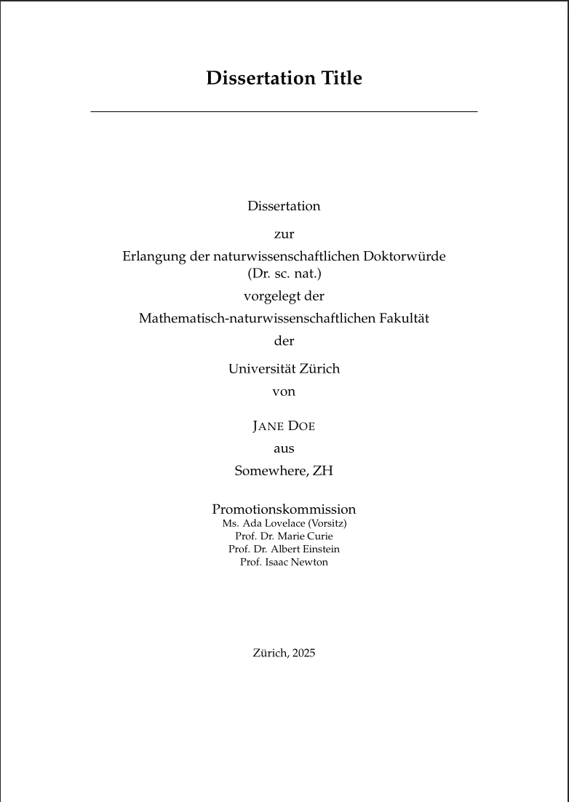

<!-- badges: start -->


[](https://creativecommons.org/licenses/by-nc-sa/3.0/)  
<!-- badges: end -->

# UZH PhD Thesis Template

This is a LaTeX template for PhD theses at the [University of Zurich (UZH)](https://www.uzh.ch/). The template is specifically designed for cumulative dissertations (paper-based theses) and includes support for incorporating published papers, comprehensive glossary management, and professional formatting.

This repository was created to relieve PhD students of the tedious work of thesis formatting, allowing them to focus on their research content.

## Important Notes

> **Disclaimer**: This is not a definitive guide to writing a PhD thesis, but rather a collection of personal notes and best practices. Feel free to extend, suggest changes via pull requests, and start discussions to improve this template.

**Background**: This template is based on the experiences gathered while writing the PhD thesis:
- Delucchi, M. (2025). *Modelling Evolution of the Intracranial Aneurysm Disease by Applying Probabilistic Graphical and Machine Learning Models.* (Dissertation, University of Zurich) [https://doi.org/10.5167/uzh-279929](https://doi.org/10.5167/uzh-279929)

**Important Considerations**:
- Each research field has its own conventions and writing styles
- Each research institution has its own specific requirements and guidelines
- **Seek guidance** from:
  - Your supervisors
  - Former PhD students in your research group
  - PhD students from other research groups in your field
  - Your faculty's student office
  - University librarians
- Always verify that this template meets your specific institutional requirements before extensive use




## Usage

### Getting Started

1. **Fork or Clone this Repository**
   ```bash
   git clone https://github.com/furrer-lab/UZH_thesis-template.git
   cd UZH_thesis-template
   ```

2. **Edit the Template Files**
   - Update `main.tex` with your thesis metadata
   - Edit chapter files in `Chapters/` directory
   - Add your figures to `Figures/` directory
   - Update bibliography in `example.bib`

3. **Compile Your Thesis**
   
   For automatic compilation (recommended):
   ```bash
   latexmk -pdf main.tex
   ```
   
   Or manually:
   ```bash
   pdflatex main.tex
   biber main
   makeglossaries main
   pdflatex main.tex
   pdflatex main.tex
   ```

### Using with Overleaf

While this template is not yet available as an Overleaf template, you can still use it with Overleaf:

1. Fork this GitHub repository to your account
2. Log in to [Overleaf.com](https://www.overleaf.com/)
3. Create a *New Project* → *Import from GitHub*
4. Select your forked repository

This allows you to share your thesis with supervisors for collaborative editing and commenting.

### Local LaTeX Setup

For local compilation, ensure you have:
- A complete LaTeX distribution (TeX Live, MiKTeX, or MacTeX)
- The `biber` bibliography processor
- The `makeglossaries` script

On Ubuntu/Debian:
```bash
sudo apt-get install texlive-full
```

On macOS with Homebrew:
```bash
brew install --cask mactex
```

## Template Structure

This template is organized for a cumulative (paper-based) PhD thesis:

```
├── main.tex                    # Main document with thesis information block
├── preamble.tex               # Package imports and settings
├── MastersDoctoralThesis.cls  # Document class (modify for institutional requirements)
├── example.bib                # Bibliography file (BibTeX format)
├── Front/                     # Front matter
│   ├── titlepage.tex          # Title page
│   ├── abstract.tex           # Abstract
│   ├── acknowledgements.tex   # Acknowledgements
│   ├── declaration.tex        # Declaration of authorship
│   ├── abbreviations.tex      # List of abbreviations
│   ├── symbols.tex            # List of symbols
│   └── ...
├── Chapters/                  # Main content chapters
│   ├── Introduction.tex       # Background and context
│   ├── PaperOverview.tex      # Summary of all papers
│   ├── paper1.tex             # Individual papers (Paper I, II, III...)
│   ├── Conclusion.tex         # Synthesis and future work
│   └── papers/                # PDF files of published papers
├── Appendices/                # Additional materials (each in separate .tex file)
├── Figures/                   # Images and diagrams (PDF, PNG, JPG)
└── Code/                      # Code listings and examples
```

**Key Files**:
- **main.tex**: Update the "THESIS INFORMATION" block with your details
- **MastersDoctoralThesis.cls**: Modify if needed to comply with institutional guidelines
- **preamble.tex**: Add custom packages and define acronyms here

---

## Quick Reference Guide

This section provides a quick reference for common LaTeX commands used in this template.

### Glossary & Acronyms

The template uses the `glossaries` package for consistent terminology management.

| Command | First Use | Subsequent Use | When to Use |
|---------|-----------|----------------|-------------|
| `\gls{ia}` | intracranial aneurysm (IA) | IA | Normal usage |
| `\Gls{ia}` | Intracranial aneurysm (IA) | IA | Start of sentence |
| `\glspl{ia}` | intracranial aneurysms (IAs) | IAs | Plural |
| `\Glspl{ia}` | Intracranial aneurysms (IAs) | IAs | Plural, start of sentence |
| `\acrfull{ia}` | intracranial aneurysm (IA) | intracranial aneurysm (IA) | Force full form |
| `\acrlong{ia}` | intracranial aneurysm | intracranial aneurysm | Long form only |
| `\acrshort{ia}` | IA | IA | Short form only |

**Defining Acronyms:**
```latex
% In preamble.tex or chapter beginning
\newacronym{ml}{ML}{Machine Learning}
\newacronym{ai}{AI}{Artificial Intelligence}

% For paper metadata
\newacro{paper1title}{Full Title of the Paper}
\acl{paper1title}  % Expands to full title
```

### Dashes

LaTeX has three types of dashes:

| Type | LaTeX | Example | When to Use |
|------|-------|---------|-------------|
| **Hyphen** | `-` | `well-known method` | Compound words, prefixes |
| **En-dash** | `--` | `pages 10--25` | Ranges, compound adjectives |
| | | `patient--level data` | |
| **Em-dash** | `---` | `Results---though preliminary---suggest` | Parenthetical breaks |

**Rules:**
- ✅ Use en-dash for compound adjectives before nouns: `real--world data`
- ✅ Use en-dash for ranges: `10--20 patients`
- ❌ Don't use hyphen for ranges: `10-20`

### Citations

| Command | Output | When to Use |
|---------|--------|-------------|
| `\autocite{key}` | (Author, 2020) | Standard citation |
| `\autocite[p.~42]{key}` | (Author, 2020, p. 42) | With page number |
| `\autocite{key1,key2}` | (Author1, 2020; Author2, 2021) | Multiple sources |
| `\textcite{key}` | Author (2020) | Textual citation |

**Rules:**
- ✅ No space before citation: `text\autocite{key}.`
- ❌ Space before citation: `text \autocite{key}.`

### Cross-References

| Element | Label Format | Reference Format |
|---------|--------------|------------------|
| **Chapter** | `\label{chap:name}` | `Chapter~\ref{chap:name}` |
| **Section** | `\label{sec:name}` | `Section~\ref{sec:name}` |
| **Figure** | `\label{fig:name}` | `Figure~\ref{fig:name}` |
| **Table** | `\label{tab:name}` | `Table~\ref{tab:name}` |
| **Equation** | `\label{eq:name}` | `Equation~\ref{eq:name}` |

**Example:**
```latex
\section{Introduction}
\label{sec:introduction}

% Later reference it:
As discussed in Section~\ref{sec:introduction}...
```

### Figures and Tables

**Figure:**
```latex
\begin{figure}[htbp]
    \centering
    \includegraphics[width=0.8\textwidth]{Figures/diagram.pdf}
    \caption{Brief description of what the figure shows.}
    \label{fig:overview}
\end{figure}
```

**Table:**
```latex
\begin{table}[htbp]
    \centering
    \caption{Table caption goes here.}
    \label{tab:results}
    \begin{tabular}{lcc}
        \hline
        \textbf{Column 1} & \textbf{Column 2} & \textbf{Column 3} \\
        \hline
        Row 1 & Value 1 & Value 2 \\
        Row 2 & Value 3 & Value 4 \\
        \hline
    \end{tabular}
\end{table}
```

### Math

**Inline math:**
```latex
The variable $x$ represents the parameter.
```

**Display math (numbered):**
```latex
\begin{equation}
    P(A|B) = \frac{P(B|A)P(A)}{P(B)}
    \label{eq:bayes}
\end{equation}
```

### Lists

**Itemized (bullets):**
```latex
\begin{itemize}
    \item First point
    \item Second point
\end{itemize}
```

**Enumerated (numbers):**
```latex
\begin{enumerate}
    \item First step
    \item Second step
\end{enumerate}
```

### Common Mistakes to Avoid

❌ **Space before citation**
```latex
text \autocite{ref}  ❌
text\autocite{ref}   ✅
```

❌ **Missing non-breaking space**
```latex
Figure \ref{fig:x}   ❌
Figure~\ref{fig:x}   ✅
```

❌ **Wrong dash type**
```latex
pages 10-25          ❌
pages 10--25         ✅
```

❌ **Hard-coded numbers**
```latex
see Chapter 3                      ❌
see Chapter~\ref{chap:three}       ✅
```

---

## Detailed Template Guide

### Thesis Structure for Cumulative Dissertations

This template is designed for cumulative (paper-based) PhD theses with the following structure:

1. **Introduction** - Background, motivation, and context (15-25 pages typical)
2. **Paper Overview** - Summary of all included papers
3. **Individual Papers** (Paper I, II, III, ...) - Full papers as PDF inclusions
4. **Conclusion** - Synthesis, contributions, and future work (20-35 pages typical)

### Chapter Files

#### Introduction.tex
**Purpose**: Establish research context, motivate the problem, and introduce key concepts.

**Typical Structure**:
- Background and motivation
- Problem statement
- Key concepts and terminology
- Research landscape overview
- Thesis structure overview

#### PaperOverview.tex
**Purpose**: Provide comprehensive summary of all papers.

**For each paper include**:
- Full title
- Author list
- Publication venue and DOI/URL
- Abstract
- Scientific contributions
- Author contributions (required by many universities)

#### paper1.tex, paper2.tex, paper3.tex
**Purpose**: Include full published (or submitted) papers as PDF files.

**Structure**:
```latex
\chapter*{Paper I: Title}
\label{Paper1}

% Metadata
\textbf{Authors:} Author A, Author B\\
\textbf{Published in:} Journal Name (Year)\\
\textbf{DOI:} \url{https://doi.org/...}

% Include the PDF
\includepdf[pages=-]{Chapters/papers/paper1.pdf}
```

#### Conclusion.tex
**Purpose**: Synthesize findings, demonstrate cumulative contribution, discuss limitations.

**Typical Structure**:
- Main results (addressing research questions)
- Overall contributions (what's new?)
- Methodological innovations
- Limitations
- Future research directions
- Broader impact

### Special LaTeX Commands

#### Fixed-Space Words
Prevent line breaks within compound terms:
```latex
\fixedspaceword{real--world}
\fixedspaceword{state--of--the--art}
```

#### Emphasis and Formatting
```latex
\emph{emphasized text}    % Usually italics
\textit{italic text}      % Explicit italic
\textbf{bold text}        % Bold
```

#### Code and Verbatim
```latex
\verb|code_snippet|       % Inline code
```

### Best Practices

#### 1. Consistency
- Use abbreviations consistently throughout
- Maintain consistent terminology via `\gls{}` commands
- Follow the same citation style everywhere

#### 2. Line Breaks in Source
- Break lines at ~80 characters for readability
- One sentence per line makes version control easier

#### 3. File Organization
- Keep figures in `Figures/` directory
- Keep code listings in `Code/` directory
- Keep appendices in `Appendices/` directory
- Keep chapters in `Chapters/` directory

#### 4. Compilation
For proper reference and glossary resolution, compile in this order:
```bash
pdflatex main.tex         # First pass
biber main                # Process bibliography
makeglossaries main       # Process glossaries
pdflatex main.tex         # Second pass (resolve references)
pdflatex main.tex         # Third pass (finalize)
```

Or use `latexmk` for automatic compilation:
```bash
latexmk -pdf main.tex
```

### Troubleshooting

| Problem | Solution |
|---------|----------|
| References show as ?? | Compile twice |
| Acronyms not expanding | Compile 3x with makeglossaries |
| Citation undefined | Run biber, then compile again |
| Figure not found | Check file path and extension |
| Label multiply defined | Search for duplicate `\label{}` |

### Pre-Submission Checklist

Before final submission:
- [ ] All references resolve (no ??)
- [ ] All acronyms expand correctly on first use
- [ ] Consistent dash usage throughout
- [ ] No space before `\autocite{}`
- [ ] All figures and tables have captions and labels
- [ ] Cross-references use descriptors (Chapter~, Figure~, etc.)
- [ ] Compiled at least 3 times for final version
- [ ] Spell check completed
- [ ] University formatting requirements met
- [ ] All paper PDFs included in `Chapters/papers/`
- [ ] Author contributions clearly stated

---

## Additional Resources

- [LaTeX Wikibook](https://en.wikibooks.org/wiki/LaTeX)
- [Glossaries Package Documentation](https://ctan.org/pkg/glossaries)
- [Biblatex Documentation](https://ctan.org/pkg/biblatex)
- [Professional Tables in LaTeX](https://www.inf.ethz.ch/personal/markusp/teaching/guides/guide-tables.pdf)

---

## Show your support

Give a ⭐ if this project helped you!

<a href="https://www.buymeacoffee.com/matd" target="_blank"></a>

## Contribution

Feel free to contribute to this project to improve it.

### How to Contribute

1. Fork this repo if you didn't already.
2. Clone into a new dev branch.
3. Commit changes on the dev branch.
4. Open a [pull request](https://docs.github.com/en/free-pro-team@latest/github/collaborating-with-issues-and-pull-requests/creating-a-pull-request-from-a-fork) to merge into the [main branch of the original repository](https://github.com/furrer-lab/UZH_thesis-template/tree/main)

## Authorship \& Licence

### Template History

This LaTeX thesis template has evolved through several iterations:

1. **Original Style File**: Created by [Steve R. Gunn](http://users.ecs.soton.ac.uk/srg/softwaretools/document/templates/) from the University of Southampton (UK), Department of Electronics and Computer Science.

2. **Skeleton Framework**: [Sunil Patel](http://www.sunilpatel.co.uk/thesis-template/) modified Steve's style file by creating a folder structure and framework.

3. **Version 2.0**: Major modifications by [Vel](mailto:vel@latextemplates.com) and Johannes Böttcher, distributed via [LaTeXTemplates.com](http://www.latextemplates.com/template/masters-doctoral-thesis).

4. **ZHAW Adaptation**: Matteo Delucchi adapted Version 2.0 for ZHAW University thesis guidelines.

5. **UZH Cumulative Dissertation Template**: Current version adapted for University of Zurich PhD theses (cumulative dissertations) by Matteo Delucchi and contributors.

### License

This template is distributed under the [Creative Commons Attribution-NonCommercial-ShareAlike 3.0 License](https://creativecommons.org/licenses/by-nc-sa/3.0/).
